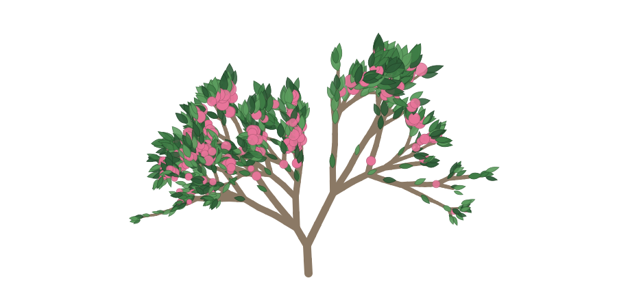

<!-- ═══════════════════════════════════════════════════════════════════
     BANNER PLACEHOLDER: ~1000×240
════════════════════════════════════════════════════════════════════ -->

  <a href="https://diya.wiki"><b>diya.wiki</b></a>&nbsp;&nbsp;·&nbsp;&nbsp;
  <a href="https://linkedin.com/in/diyasingh03">linkedin</a>&nbsp;&nbsp;·&nbsp;&nbsp;
  <a href="https://codeforces.com/profile/diyuuu">codeforces</a>

I build machine-learning systems the way a painter mixes pigment - *precisely, and on purpose*.

- 🎓 CS @ **Purdue** (combined BS/MS) - machine intelligence · graphics & visualization · systems · algorithmic foundations, with minors in **Art & Design Studio** and **Mathematics**
- 🔭 currently: AI & ML Automation Intern at Envita Solutions and on the side building **bloom**, benchmarking object detectors under corruption, and tending [diya.wiki](https://diya.wiki)
- 🧑‍🏫 Head TA for 400+ students in Problem Solving & OOP - I like making hard things feel learnable, also TA'd Discrete Mathematics and Analysis of Algorithms.

### 🌳 today's tree

grown fresh every day by a script that lives right here → [`art/grow.py`](art/grow.py) - a 2D cousin of [Procedural3DTree](https://github.com/Diyasingh03/Procedural3DTree). come back tomorrow for a different one.

### selected work

| | |
| --- | --- |
| 🌸&nbsp;**[bloom](https://github.com/Diyasingh03/bloom)** | A PCOS management app that syncs meals, workouts, and daily AI guidance to your cycle phase - designed and built end-to-end. React Native · Expo · Gemini |
| 🃏&nbsp;**[Flip7-AI](https://github.com/kraisr/Flip7-AI)** | An agent that plays the push-your-luck card game Flip 7 - dynamic programming over game states to decide when to flip and when to walk away. Python |

also: **ReadCoin** - eye-tracking reading app, HackMIT finalist · **Procedural3DTree** - L-system trees in C + OpenGL · [everything else on diya.wiki →](https://diya.wiki)

### up next

🌱 **latent garden** - feed it a song or a paragraph; a model maps what it hears onto L-system grammar parameters and grows a one-of-a-kind procedural tree in the browser. *(watch this space)*

### toolbox

**ml / cv** - Python · PyTorch · pandas · YOLO / RT-DETR · Gemini API 
**systems** - C · C++ · Java 
**web & apps** - TypeScript · React / React Native · Next.js · FastAPI 
**canvas** - OpenGL · generative SVG · Illustrator · Photoshop · Affinity Designer

  <picture>
    <source media="(prefers-color-scheme: dark)" srcset="https://github-readme-stats-git-master-rickstaa.vercel.app/api?username=Diyasingh03&show_icons=true&hide_border=true&include_all_commits=true&rank=false&theme=dark&bg_color=00000000">
    
  </picture>
  <picture>
    <source media="(prefers-color-scheme: dark)" srcset="https://github-readme-stats-git-master-rickstaa.vercel.app/api/top-langs/?username=Diyasingh03&layout=compact&hide_border=true&theme=dark&bg_color=00000000">
    
  </picture>

